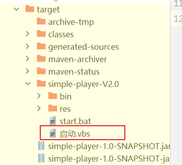
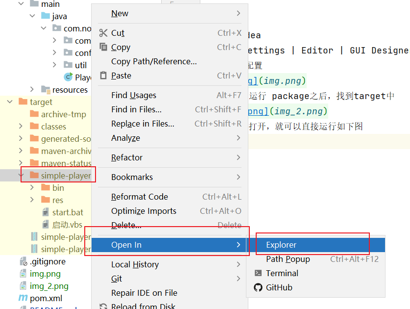
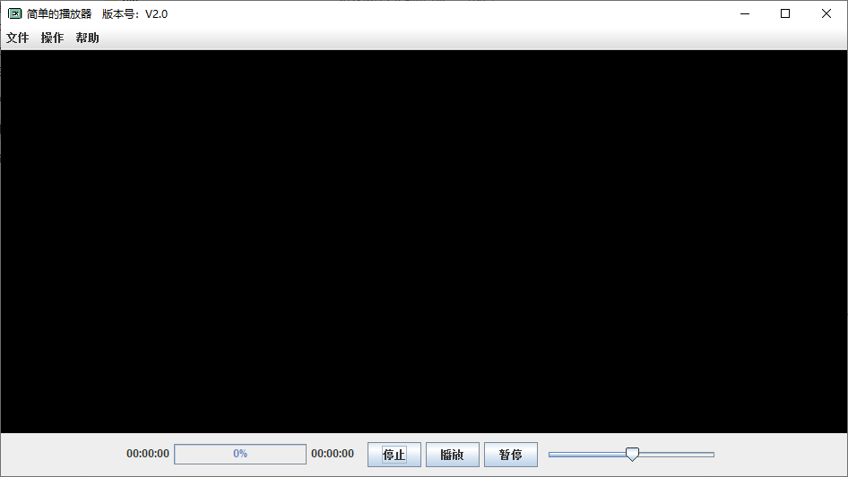

# 简单的播放器

#### 介绍
一个简单的播放器，我起了个名字叫做《sp播放器》，是simple-player的意思

使用说明：
### 一、配置idea
File | Settings | Editor | GUI Designer
中 如下图配置

### 二、Maven运行 package之后，找到target中

### 三、在文件夹中打开，就可以直接运行如下图

# 点个star吧
