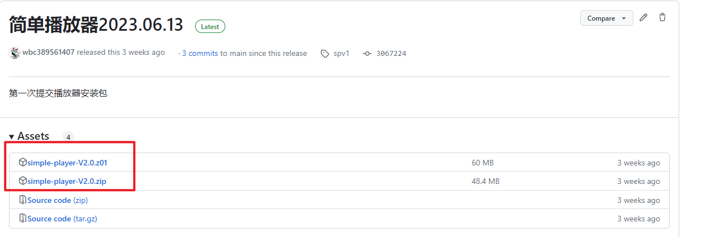

# 简单的播放器

#### 介绍
一个简单的播放器，我起了个名字叫做《sp播放器》，是simple-player的意思

# 使用说明
### 一、下载
https://github.com/wbc389561407/simple-player/releases/tag/spv1

### 二、解压
下载所有文件，解压到一个文件夹中,进行解压
### 三、运行
解压后，运行simple-player.exe
### 四、使用
可以播放普通文件,如果需要播放加密文件，需要激活

# 关联项目
### 加密项目
### https://github.com/wbc389561407/e-file-tool.git

### 解密项目
### https://github.com/wbc389561407/d-file-tool.git

### 简单播放器
### https://github.com/wbc389561407/simple-player.git

# 搭建打包：
### 一、配置idea
File | Settings | Editor | GUI Designer
中 如下图配置

### 二、Maven运行 package之后，找到target中

### 三、在文件夹中打开，就可以直接运行如下图

# 点个star吧
